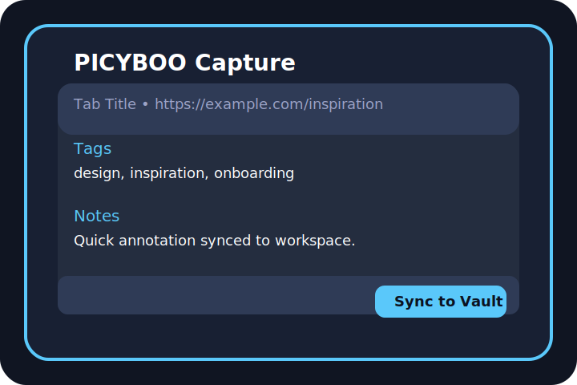

# PICYBOO Browser Stub Extension (MV3)

This repository contains a small Manifest V3 extension that records basic tab metadata into a local vault. It is intended for compliance demonstrations and internal evaluation where a minimal, transparent capture flow is required.



## Feature overview
- **Capture in context:** Store the active tab, thumbnail metadata, tags, and research notes with a single click.
- **Structured output:** Persisted entries are normalized so they can be exported for further processing.
- **Integrity hash:** Each capture includes a content hash to verify the recorded URL without storing page contents.

## Guided workflow
1. Launch the popup on any tab to preview the detected title and URL.
2. Add optional tags, notes, and a confidence rating.
3. Save to the local capture vault; entries remain on-device and can be exported as JSON when needed.

## Architecture at a glance
- `popup.html` & `popup.css` define the user interface for entering capture details.
- `popup.js` orchestrates the capture flow, hashing the active URL and persisting structured entries to `chrome.storage`.
- `background.js` registers context menu shortcuts and keeps the vault hydrated with the latest tab metadata.
- `examples/sync_mock.js` demonstrates how exports might be ingested by downstream systems.

## Developer quickstart
```bash
# Install dependencies for mock tooling (optional)
npm install

# Lint the example script
npm run lint
```

To load the extension during development:
1. Open Chrome and navigate to **Extensions → Manage Extensions**.
2. Enable **Developer mode** and choose **Load unpacked**.
3. Select this repository and pin the PICYBOO icon to your toolbar.
4. Open any page, click the icon, enrich the capture, and press **Sync to Vault**.

## Data handling & compliance
The stub keeps all data on-device and never transmits browsing information. Review the dedicated documents for details:
- [`docs/privacy.md`](docs/privacy.md)
- [`CONTRIBUTING.md`](CONTRIBUTING.md)
- [`CHANGELOG.md`](CHANGELOG.md)

## Roadmap highlights
- Optional secure sync connector (REST + signed payloads)
- Workspace filtering and saved views
- Automated capture suggestions powered by internal ML services

## Legal
© Picyboo Cybernetics. MIT License. PICYBOO® — US 97338199 / CA 2173851.

## Links
- Website: https://picyboo.com
- Technical Sandbox: https://picyboo.net
- GitHub Organization: https://github.com/Picyboo-Cybernetics
